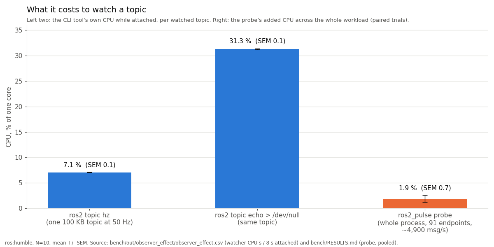
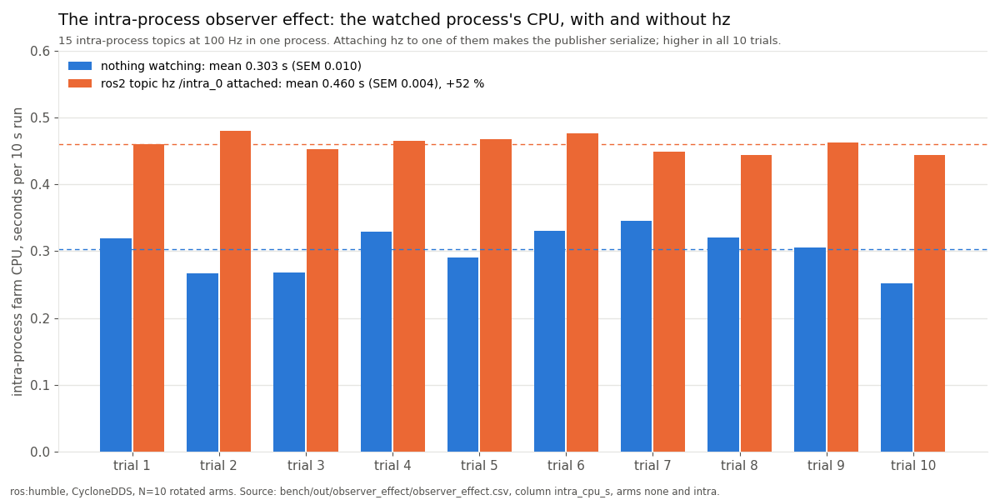

# Watching a ROS 2 topic changes it

*Tanay, 2026-09-18*

The question I wanted answered on a robot is small: is every topic flowing at the rate it
should, and is every node still alive? In ROS 2 a topic is a named publish/subscribe channel
and a node is a participant that publishes or subscribes to some of them. Messages travel over
DDS, a discovery-based middleware, unless publisher and subscriber sit in the same process, in
which case rclcpp (the C++ client library) can hand the message across a ring buffer without
serializing it at all.

The obvious tool is `ros2 topic hz`. It subscribes to the topic, counts arrivals and prints an
average. That is the problem in one word: subscribes. The tool is a participant in the graph
it measures: it joins DDS discovery, matches with the publisher, and receives and deserializes
every message to count it. `ros2 topic echo` does the same and prints the contents. Both watch
one topic per invocation, and neither can see intra-process traffic, because a message that
never touches the middleware never reaches them.

## What a subscriber costs

I measured it. The harness is
[`bench/run_observer_effect.sh`](../../bench/run_observer_effect.sh): a stock `ros:humble`
container, CycloneDDS, on a 16-core AMD Ryzen 7 7435HS. The workload is a stress farm of 30
light topics at 100 Hz and 8 heavy topics (about 100 KB each) at 50 Hz between processes, plus
15 intra-process topics at 100 Hz inside one process, all with subscribers. Four arms rotate
each trial so warm-up and drift cancel: nothing watching, `ros2 topic hz /heavy_0`,
`ros2 topic echo /heavy_0 > /dev/null`, and `ros2 topic hz /intra_0`. Ten trials, ten-second
runs, the watcher attached for eight of them. The probe described below runs in every arm as
the ruler: it counts publish calls inside the publishing process, so its rate is the true one
whatever else is subscribed.

First finding: the CLI is accurate. The publisher held 50.000 Hz in every arm and `hz` printed
49.845 ± 0.053. I expected a slow reliable reader of 100 KB messages to back-pressure the
writer; on this box at this load it did not.

Second: it is not free. `hz` on one 100 KB topic used 0.566 s ± 0.005 of CPU over its 8 s,
which is 7.1 % of a core. `echo` on the same topic with its output discarded used
2.504 s ± 0.007, or 31.3 % of a core. Per topic, for as long as you look. The publisher farm's
own CPU did not move measurably with one more inter-process reader.



## The surprise

The fourth arm points `hz` at an intra-process topic. The intra-process farm (one process, 15
topics at 100 Hz) used 0.303 s ± 0.010 of CPU per run with nothing watching, and
0.460 s ± 0.004 with `hz` attached to one of its fifteen topics. That is +52 %, and every one
of the ten watched runs was higher than every one of the ten unwatched runs.



With intra-process communication enabled,
rclcpp's publish path compares the topic's subscription count with its intra-process
subscription count. When they match, the message goes into the intra-process manager's buffer
and is delivered by pointer; serialization and the DDS write are skipped, and `rcl_publish`,
the C-layer function that hands a message to the middleware, is never called. The moment an
external subscriber matches, the counts differ. From then on every message is also serialized
and written to DDS for the newcomer. The watched process does work it never did before, on
every message, for as long as the watcher is attached.

The probe made this visible. The publish-side `rcl_publish` tracepoint for `/intra_0`, which
never fires with nothing attached, lit up in 4 of the 5 two-second windows of each run (the
first window is mostly over before the watcher attaches), in 10 trials out of 10. And `hz`
reported 99.997 Hz, which is right. The number is correct; the system it describes is no
longer the one that was running before you looked.

## Counting without subscribing

The way out is to count where the message already is: inside the publishing process, on a
call path that every publish and every callback goes through anyway.

ROS 2 ships an instrumentation layer called tracetools. rclcpp and rcl call functions named
`ros_trace_rcl_publish`, `ros_trace_callback_start` and so on at the corresponding points;
these are the hooks that LTTng-based tracing (`ros2_tracing`) records from. They are
ordinary exported functions in `libtracetools.so`, called
unconditionally; the "is a tracing session active" check lives inside the function. And on
stock Humble debs, `libtracetools.so` is not linked against lttng-ust at all, so the functions
are no-ops that are still called on every message.

`LD_PRELOAD` loads a shared object before all others, and the dynamic linker binds each symbol
reference to the first definition it finds in load order. So a shim that exports its own
`ros_trace_rcl_publish` receives every call rclcpp makes, does its counting, and forwards to
the original, which it locates once with `dlsym(RTLD_NEXT, ...)`: the next definition after
mine in load order. That is the whole probe:

```cpp
// src/probe/interposers.cpp, trimmed
template <typename Fn>
auto realFn(const char* name) -> Fn {
    return reinterpret_cast<Fn>(dlsym(RTLD_NEXT, name));  // libtracetools' own definition
}

extern "C" {

ROS2_PULSE_EXPORT void ros_trace_rcl_publish(const void* pub_handle, const void* message) {
    ProbeRuntime::instance().registry().onPublish(pub_handle);   // one relaxed fetch_add
    static auto fn = realFn<void (*)(const void*, const void*)>("ros_trace_rcl_publish");
    if (fn) fn(pub_handle, message);                             // forward; a no-op on stock Humble
}

ROS2_PULSE_EXPORT void ros_trace_callback_start(const void* callback, bool is_intra_process) {
    ProbeRuntime::instance().registry().onCallbackStart(callback, is_intra_process);
    static auto fn = realFn<void (*)(const void*, bool)>("ros_trace_callback_start");
    if (fn) fn(callback, is_intra_process);
}

}  // extern "C"
```

`callback_start` is the intra-process answer: it fires for every subscription callback
regardless of transport and carries an `is_intra_process` flag, so a message that skipped DDS
is still counted, at the receiver, with no change to how it was delivered. The init
tracepoints (`rcl_node_init`, `rcl_publisher_init`, `rcl_subscription_init` and two rclcpp
ones) are hooked as well; they fire rarely and map opaque handles to topic names.

Hot-path resolution goes through a 256-slot thread-local cache keyed by handle. A hit is one
`fetch_add` with `memory_order_relaxed` on the endpoint's counter; a miss takes a shared lock;
only the first sighting of a callback takes the write lock. There is no global mutex and no
string hashing per message.

A timer thread wakes every few seconds (`ROS_TOPIC_STATISTICS_PUBLISH_PERIOD`, default 5),
swaps every counter to zero with `exchange`, divides by the window and appends a block of text
or one JSON line to a file. Nothing joins the DDS graph and no socket is opened.

One detail matters for something that gets preloaded into every process on a robot: the shim
must not leak symbols. The library is compiled with `-fvisibility=hidden`, the interposers
carry `visibility("default")` explicitly, and a linker version script keeps the dynamic symbol
table to exactly that contract:

```
{ global: ros_trace_*; local: *; };
```

The version script exists because libstdc++ headers force some template instantiations back
to default visibility; an integration test pins the exported set.

## What it costs

The probe's cost is measured the same way, with error bars. A single ten-second sample of this
workload swings about ±4 % run to run, enough to fake or hide a 2 % effect, so the overhead
harness runs baseline and probe back to back in each trial with the order alternated every
trial, and reports the mean of the per-trial differences with its standard error. A difference
counts as real only if it clears about twice the SEM. A fixed arm order with N=6 misled me
once, which is why the protocol is written down.

On the same stress farm, about 4,900 messages per second across 91 endpoints and three
processes, the pooled result over Humble, Jazzy and Kilted (N=10 per distro) is
+0.049 s ± 0.018 on roughly 2.5 s of workload CPU, or +1.9 % ± 0.7 %. Per message that is
about 1 µs added against the roughly 51 µs the stack already spends delivering it.

The counting itself is not where that goes. In a microbenchmark with eight threads, a
warm-cache hit costs 0.3 ns per operation on x86-64, and 0.6 to 1.2 ns when each thread
alternates across four endpoints. On a Jetson AGX Orin (Cortex-A78AE at 2.2 GHz) it is 0.9 ns
fixed and 2.1 to 2.2 ns alternating, measured on a production 77-node Humble stack, on the
deployed binaries, with zero sockets opened. The residual 2 % is diffuse: the chained call into the real tracepoint,
extra code and data resident in cache and TLB across 16 executor threads, one parked flush
thread. A null shim with the same eight exported symbols and empty bodies measured 0.3 %
below baseline, so the interposition itself is free. I report the 2 % rather than subtracting
it.

## Limits

This is a counter, not a tracer. It reports rates and largest inter-arrival gaps per window,
not per-message loss and not latency. It needs the tracepoints compiled into the ROS build,
the default on stock debs; `nm -D` on `libtracetools.so` shows whether they are there. Python nodes are counted on the publish side
only, because `rcl_publish` fires in C under rclpy but `callback_start` is emitted by rclcpp,
and rclpy was never instrumented. On Humble there is no intra-process publish tracepoint, so
intra-process rate is measured at the receiver. The observer-effect numbers are one box, one
distro, one RMW, 100 KB messages at 50 Hz; a slower CPU, bigger messages or several watchers
scale the watcher's cost without changing the first finding.

## What exists now

The probe is [`ros2_pulse`](../../README.md), Apache-2.0:
`apt install ros-$ROS_DISTRO-ros2-pulse` (Jazzy from the main ROS 2 repository, Humble and
Kilted from `ros2-testing` until the next sync). [`pulse-top`](../../tools/pulse-top/README.md)
(`pip install ros2-pulse-top`) is a terminal dashboard over the log, with a `recv_lag` warn
when a subscriber's callback rate falls under the publish rate for several windows.
[`pulse_bridge`](../../README.md#publishing-on-statistics-pulse_bridge) republishes the
windows on `/statistics` in the shape of rclcpp's built-in topic statistics, from a separate
process, so existing dashboards get intra-process rates too. The [design notes](../DESIGN.md)
and the [alternatives survey](../ALTERNATIVES.md) cover what built-in statistics, LTTng, CARET
and eBPF uprobes each give up.

## Reproduce it

The observer-effect run is one command in a stock container:

```bash
docker run --rm -v "$PWD":/pkg -v /tmp/oe:/work ros:humble-ros-base \
  bash /pkg/bench/run_observer_effect.sh
```

It builds the probe and stress nodes, runs the four arms ten times, and writes the CSV,
evidence and summary to `/tmp/oe`. The tables, the paired-overhead
protocol and the hot-path microbenchmarks are in [`bench/RESULTS.md`](../../bench/RESULTS.md);
the figures above are
[`bench/plot_observer_effect.py`](../../bench/plot_observer_effect.py) over the committed raw
[CSV](../../bench/out/observer_effect/observer_effect.csv).

<!--
Sources for every number in this post (file:line in this repository):
- workload (30 light @100 Hz, 8 heavy ~100 KB @50 Hz, 15 intra @100 Hz; ~4,900 msg/s, 91 endpoints, 3 processes): bench/RESULTS.md:4-5, :106-107
- ros:humble, CycloneDDS default, AMD Ryzen 7 7435HS, 16 cores: bench/RESULTS.md:105; bench/out/observer_effect/platform.txt:1-4
- four rotated arms, N=10, 10 s runs, watcher attached 8 s: bench/RESULTS.md:109; bench/run_observer_effect.sh:22-23, :86-95
- probe as the ruler (counts rcl_publish in-process): bench/RESULTS.md:107-108; bench/run_observer_effect.sh:3-5
- publisher held 50.000 Hz, hz reported 49.845 ± 0.053: bench/RESULTS.md:114-115
- hz 0.566 s ± 0.005 = 7.1 % of a core; echo 2.504 s ± 0.007 = 31.3 %: bench/RESULTS.md:115-116 (CSV column watcher_cpu_s / 8 s, bench/out/observer_effect/observer_effect.csv)
- publisher / subscriber CPU did not move with an extra inter-process reader: bench/RESULTS.md:133-134
- intra farm CPU 0.303 s ± 0.010 unwatched vs 0.460 s ± 0.004 watched, +52 %: bench/RESULTS.md:114, :117; per-trial values bench/out/observer_effect/observer_effect.csv (column intra_cpu_s; none max 0.345, intra min 0.444)
- hz reported 99.997 on /intra_0; TOPIC /intra_0 windows 4/5 in 10/10 trials: bench/RESULTS.md:117, :127-132; bench/out/observer_effect/evidence/intra/intrafarm.log; watcher attach timing bench/run_observer_effect.sh:51-54
- intra-process delivery bypasses rmw and rcl_publish; first out-of-process subscriber forces serialization: docs/DESIGN.md:5-8; bench/run_observer_effect.sh:10-12, :42-44
- tracetools functions called unconditionally, enable check inside, exported from libtracetools.so: src/probe/interposers.cpp:7-11; docs/DESIGN.md:12-14; README.md:77-82
- stock Humble libtracetools.so not linked against lttng-ust (no-ops): bench/RESULTS.md:22-24; test/orin/RESULTS.md:44
- dlsym(RTLD_NEXT) cached in a function-local static: src/probe/interposers.cpp:440-443, :498-502, :515-519; docs/DESIGN.md:33-36
- callback_start fires for every callback with is_intra_process: src/probe/interposers.cpp:13-15; docs/DESIGN.md:17-18
- hooked init tracepoints: src/probe/interposers.cpp:456-492; docs/DESIGN.md:38-43
- 256-slot thread-local cache, relaxed fetch_add, shared lock on miss, write lock on first sighting: include/ros2_pulse/core/topic_registry.hpp:89-92; src/core/topic_registry.cpp:279-299; bench/RESULTS.md:78-79
- separate publish / receive atomics: include/ros2_pulse/core/topic_registry.hpp:21-32
- timer thread snapshot + exchange to zero, PUBLISH_PERIOD default 5.0, file output: README.md:90-91, :157; src/core/topic_registry.cpp:383-386
- no DDS traffic, no sockets: src/probe/interposers.cpp:10-11; test/orin/RESULTS.md:68-69
- -fvisibility=hidden, visibility("default") on interposers, version script, integration test pins the set: src/probe/interposers.cpp:447-450; CMakeLists.txt:84-95; src/probe/exports.map:1-10
- ±4 % single-run swing, order-alternated paired trials, 2x SEM rule, fixed order with N=6 misled once: bench/RESULTS.md:28-32
- pooled +0.049 s ± 0.018, +1.9 % ± 0.7 %, N=10 per distro, baselines ~2.45-2.57 s: bench/RESULTS.md:36-41
- ~1 µs added per message vs ~51 µs: bench/RESULTS.md:43-44
- hot path 0.3 ns fixed, 0.6-1.2 ns alt-4 (x86, 8 threads): bench/RESULTS.md:62-74
- Orin 0.9 ns fixed, 2.1-2.2 ns alt-4, Cortex-A78AE @ 2.2 GHz, 77-node production stack, deployed binaries, 0 sockets: bench/RESULTS.md:83-93; test/orin/RESULTS.md:3-4, :9, :34-36, :50-54, :68-69
- null shim (8 exported symbols) 0.3 % below baseline; residual attribution (chained call, cache/TLB, 16 executor threads, flush thread): bench/RESULTS.md:49-59
- limits: tracepoints compiled in (default on stock debs), nm -D check, rclpy publish-side only, no Humble intra-publish tracepoint, gaps not loss/latency: README.md:131-137, :353-367; docs/ALTERNATIVES.md:80-86
- observer-effect caveats (one box, one distro, one RMW, 100 KB @ 50 Hz): bench/RESULTS.md:136-137
- apt: Jazzy main, Humble/Kilted ros2-testing: README.md:98-114
- pulse-top pip name and recv_lag: README.md:16, :123-129, :190-191; CHANGELOG.md:9-22; tools/pulse-top/README.md:78-83
- pulse_bridge on /statistics, separate process: README.md:199-221; CHANGELOG.md:40-50
- reproduce command: bench/RESULTS.md:165-166; bench/run_observer_effect.sh:16-17
-->
