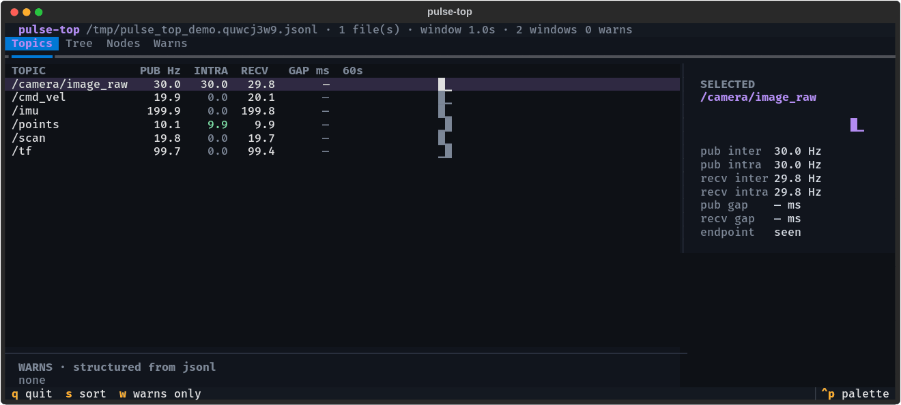

# pulse-top



Live terminal dashboard over a `ros2_pulse` probe log. A pure log **consumer**:
no ROS dependency, no node, no subscriptions; it tails the jsonl file the probe
already writes, so watching costs the robot nothing and works over plain ssh or on
a dead log after the incident.

That is the difference from graph-joining monitors (`ros2top`, `ornis`,
`ros2_topic_monitor`, ...): they join the graph to measure it; `pulse-top` reads
what the in-process probe measured, including the intra-process traffic no
graph-side tool can see.

## Run

```bash
pip3 install ros2-pulse-top             # from PyPI; or from a checkout: pip install ./tools/pulse-top

# probe side: emit jsonl
export ROS_TOPIC_STATS_FORMAT=jsonl
LD_PRELOAD=libros2_pulse.so ros2 launch my_robot bringup.launch.py

# dashboard side (any shell, any machine with the file):
pulse-top                               # every $TMPDIR/topic_freq.<pid>.log (one per probed process)
pulse-top /path/to/shared.log           # one explicit file (e.g. a fleet-wide ROS_TOPIC_STATS_OUTPUT_FILE)
pulse-top '/var/log/topic_freq.*.log'   # a quoted glob; new files are picked up as nodes start
pulse-top --demo                        # self-generated demo graph with a scripted incident
```

## Keys

| Key | Action |
|-----|--------|
| `↑`/`↓` | select topic (detail sidebar follows) |
| `tab` | switch view: Topics · Tree · Nodes · Warns |
| `s` | cycle sort: topic / rate / gap |
| `w` | toggle warns-only filter |
| `q` | quit |

## What it shows

- **Topics**: per-topic publish/intra/receive Hz, max inter-arrival gap, 60-window
  sparkline. Absence renders as `—`; the probe's "not measured" is never shown as 0.
- **Tree**: topic namespace hierarchy with live rates.
- **Nodes**: liveness from `NODE` records; missing nodes flagged from structured warns.
- **Warns**: the probe's structured `warns[]` (`topic_rate`, `topic_gap`,
  `node_missing`), parsed as JSON rather than regex, plus one pulse-top derives
  itself from two processes' windows: `recv_lag`, below.

## Development

```bash
cd tools/pulse-top
uv venv .venv && uv pip install -p .venv/bin/python -e ".[dev]"
env -u PYTHONPATH .venv/bin/python -m pytest tests/   # clear ROS's pytest plugins
```

## Reading a live stack (many processes, one view)

Every probed process flushes its own window; a 77-node stack is ~15 windows/s interleaved
across files (or within one shared file). The view is built for that:

- **Stale is measured in time**, from the window timestamps: a topic is `stale 12s` once more
  than 1.5× its own window period has passed since its last window, regardless of how many
  other processes' windows landed in between. A 5 Hz topic on a 77-node stack used to read
  `stale 3w` for that reason (Orin, 2026-08-23).
- **Sides merge.** One process publishes `/tf_static`, twenty receive it. A receive-only window
  refreshes the `RECV` fields and leaves `PUB` as learned from the publisher's window.
- **One sparkline sample per period**, whichever process's window lands first in it.
- **Only changed cells repaint.** Textual's `DataTable.update_cell` invalidates and refreshes
  unconditionally; pulse-top diffs against what it last rendered, so an idle screen costs
  nothing over ssh.

`transition_event`, NITROS `_supported_types` and other one-shot topics going stale minutes
after startup is correct: they fired once.

## recv_lag: callbacks under the publish rate

The one warn pulse-top derives itself. The probe cannot: each probed process reports only the
endpoints it hosts, so the publisher's process carries a topic's publish rate and the
subscriber's process carries its callback rate. pulse-top already merges the two sides per
topic (above); `recv_lag` compares them. Defaults are on, no configuration needed.

| field | meaning |
|---|---|
| `kind` | `recv_lag` |
| `topic` | the topic |
| `pub_hz` | publish rate paired with the window that fired: `max(pub_inter_hz, pub_intra_hz)`, the probe's own busier-path rule (one `publish()` can fire both) |
| `recv_hz` | callback rate of that window: `recv_inter_hz + recv_intra_hz` (disjoint deliveries) |
| `deficit` | `(pub_hz - recv_hz) / pub_hz` |
| `windows` | consecutive lagging windows at fire time |
| `source` | the subscriber's log file (pulse-top only) |

Rules, applied to every window that carries a topic's receive side:

- **The publish observation must be fresh:** within 1.5 window periods of the receive window,
  the same rule that marks a row stale. A publisher that stops publishing vanishes from its own
  windows while the subscriber keeps reporting an explicit `0.0`; that pair is a dead upstream,
  not lag, and it resets the streak.
- **A window is lagging** when the deficit exceeds `--lag-tol` (default `0.10`) and the
  shortfall exceeds two messages per window (one message can cross a window boundary from phase
  offset alone; at 1 Hz on 5 s windows that is a 20% swing).
- **`--lag-windows` consecutive lagging windows fire the warn** (default `3`, which absorbs a
  subscriber's partial first window; `0` disables the detector). A deficit under half the
  tolerance clears it; in between, the warn holds, so a topic hovering at the threshold
  neither flaps nor re-fires. A warn whose subscriber stopped flushing clears after 1.5 periods.
- **Trackers are keyed by topic and source file,** so a healthy subscriber process and a lagging
  one do not reset each other. Receive above publish (two subscriptions in one process, two
  publishers) is never a warn.

The Warns tab and strip line, amber like `topic_rate` since it is an inference:

```
recv_lag       /scan recv 12.0Hz < pub 20.0Hz (-40%, 3 windows) · callbacks see fewer than published; drop or backlog, probe cannot tell which
```

**What `recv_lag` cannot tell you.** The probe counts callbacks, not wire samples. A sustained
deficit means messages were published and did not reach this process's subscription callback at
the same rate. It cannot name which messages, cannot distinguish a QoS/history drop (best-effort
loss, `KeepLast` overflow at the reader) from an executor that is behind and overwriting its
buffer, and cannot see a process that is not probed. Sequence-number loss detection needs the
wire. Two further limits: with one shared log (`ROS_TOPIC_STATS_OUTPUT_FILE` set fleet-wide)
there is no per-process provenance, a healthy and a lagging subscriber alternate in one tracker
and the warn does not fire; and on Humble an all-in-process intra topic has no publish-side rate,
so nothing is compared (Iron+ pairs `pub_intra_hz` with `recv_intra_hz` in the same window).

The probe never writes `recv_lag`. Should a log-side tool (`pulse-check`, ROADMAP R1.1) emit it,
the reserved shapes are jsonl
`{"kind":"recv_lag","topic":"/scan","pub_hz":20.000000,"recv_hz":12.000000,"deficit":0.400000,"windows":3}`
and text `WARN TOPIC /scan recv_hz=12.000000 pub_hz=20.000000 deficit=0.40 windows=3`.
